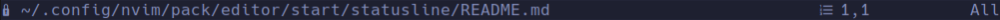
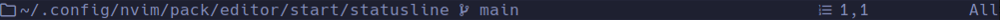

# Simple Statusline for Neovim

The main goal is to display only the most necessary information, without a lot of color, so that you can concentrate on editing the files.

Statusline for open file


Statusline for modified file


Statusline for read only file


Statusline for help file


Statusline for Netrw or NvimTree


## Installation

### [Vim Packages](https://neovim.io/doc/user/repeat.html#packages)

```lua
require('nvim-statusline')
```

### [vim-plug](https://github.com/junegunn/vim-plug)

```vim
Plug 'schillermann/nvim-statusline'
```

### [packer.nvim](https://github.com/wbthomason/packer.nvim)

```lua
use {
  'schillermann/nvim-statusline',
}
```

### [lazy.nvim](https://github.com/folke/lazy.nvim)

```lua
{
  'schillermann/nvim-statusline',
}
```
